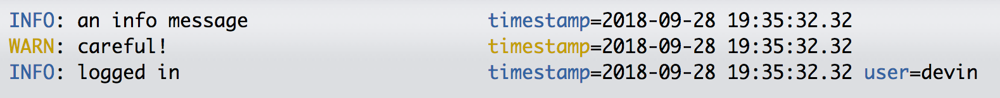

[](https://travis-ci.org/metrumresearchgroup/logrrr)

<!-- README.md is generated from README.Rmd. Please edit that file -->

```{r setup, include = FALSE}
knitr::opts_chunk$set(
  collapse = TRUE,
  comment = "#>",
  fig.path = "man/figures/README-",
  out.width = "100%"
)
```


# logrrr

The goal of logrrr is to provide structured, pluggable logging tailored to shiny applications and rest apis.
It is also useful for analytics, but provides "sugar" around activities commonly performed in applications. 

## Structured Logging 

TODO

## Basic Usage

A Logrrr instance must be initialized, and by default will use text logging to stdout.

```{r}
library(logrrr)
# likely don't call it log as it will override the mathematical log function
lgr <- Logrrr$new()
lgr$info("an info message")
lgr$warn("careful!")
lgr$with_fields(user = "devin")$info("logged in")
```

The various levels are colored 



```{r}
lgr$debug("a debug message that you won't see")
lgr$set_level("DEBUG")
lgr$debug("now you can see")
lgr$info("of course can still see info")
lgr$set_level("WARN")
lgr$info("can't see this now!")
lgr$warn("but can see this")
```


## Customization

Log levels can be set at initiation (default: info)

```{r}
lgr <- Logrrr$new(log_level = "DEBUG")
```

### JSON logging

```{r}
logjson <- Logrrr$new(output = LogOutput$new(format_func = JSONFormatter()))
logjson$info("an info message")
logjson$warn("careful!")
logjson$with_fields(user = "devin")$info("logged in")
```

### Multiple Outputs

Multiple outputs can be simultaneously logged to:

```{r}
logfile <- tempfile(fileext = ".txt")
logcomb <- Logrrr$new(output = list(text = LogOutput$new(),
                                    json = LogOutput$new(format_func = JSONFormatter(), output = logfile)))

logcomb$info("an info message")
logcomb$warn("careful!")
logcomb$with_fields(user = "devin")$info("logged in")

cat("\ncontents of log file: \n\n")
readLines(logfile)
```

## shiny application


```{r}
is_production <- function() {
  Sys.getenv("R_DEV_ENV") == "production"
}
lgr <- if (is_production()) {
  # in production don't need debug/tracing, and log as json to a file
  Logrrr$new(log_level = "INFO", outputs = LogOutput$new(format_func = JSONFormatter(), output = logfile))
} else {
  ## development mode want all log levels printed right to console
  Logrrr$new(log_level = "TRACE")
}
```

## Some performance notes

On a macbook pro (eg fast ssd), writing to a file will be more performant than printing to the console.

Interesting, the serialization cost of json is actually less than the gluing and formatting of text for structured
text logging. Hence, for log files not for easy scanning by human-only, json formatting is a great option.

|type      |    n|   median|      max| n_gc|
|:---------|----:|--------:|--------:|----:|
|logstdout |    1|   1.12ms|  38.14ms|    3|
|logtxt    |    1| 943.28µs|  26.31ms|    3|
|logjson   |    1| 681.48µs|  30.45ms|    4|
|logstdout |  100| 119.06ms| 162.62ms|    3|
|logtxt    |  100|  82.59ms|  85.94ms|    5|
|logjson   |  100|  79.81ms|  99.09ms|    4|
|logstdout | 1000|    1.14s|    1.14s|    8|
|logtxt    | 1000| 825.99ms| 825.99ms|    7|
|logjson   | 1000| 748.17ms| 748.17ms|    7|


Furthermore, the json logs can be easily coerced into a structured data frame for easy slicing and dicing.

```{r eval = FALSE}
purrr::map_dfr(readr::read_lines("path/to/log.txt"), jsonlite::fromJSON) 
```


## Installation

You can install from:

``` r
devtools::install_github("metrumresearchgroup/logrrr")
```


```{r}
si <- sessioninfo::session_info()
si$platform
sidf <- as.data.frame(si$packages,row.names = NULL)[, c("package", "ondiskversion","date", "source")]
row.names(sidf) <- NULL
sidf
```


